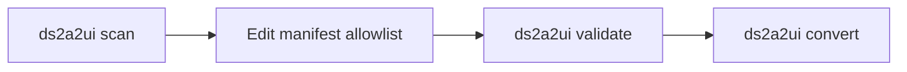

# Manifest workflow

The manifest generator produces and validates `a2ui.manifest.json` — an explicit **security allowlist** of components and props before you run `ds2a2ui convert`.

## Recommended pipeline



1. **Scan** — `ds2a2ui scan ./packages/ui` drafts `a2ui.manifest.json` and `scan-report.md`.
2. **Review** — curate `components[]`, set `includeInCatalog`, refine descriptions and required flags.
3. **Validate** — `ds2a2ui validate ./packages/ui` checks schema and business rules.
4. **Convert** — `ds2a2ui convert ./packages/ui` builds the A2UI catalog from the manifest (tokens still scanned from CSS/JSON).

## CLI commands

```bash
# Generate draft manifest (merges with existing file by default)
npx tsx src/cli.ts scan ./packages/ui --project ./packages/ui/tsconfig.json

# Overwrite entire manifest
npx tsx src/cli.ts scan ./packages/ui --force

# Validate without converting
npx tsx src/cli.ts validate ./packages/ui

# Convert using manifest as primary inventory
npx tsx src/cli.ts convert ./packages/ui --manifest ./packages/ui/a2ui.manifest.json

# Also auto-scan components missing from the manifest
npx tsx src/cli.ts convert ./packages/ui --fill-missing
```

### Flags

| Flag | Commands | Description |
| --- | --- | --- |
| `--merge` | scan | Merge scan output with an existing manifest (default: on) |
| `--force` | scan | Replace the entire manifest |
| `--project` | scan | Explicit `tsconfig.json` path for monorepos |
| `--manifest` | validate, convert | Path to manifest file |
| `--fill-missing` | convert | Auto-scan components not listed in the manifest |
| `--out` | scan, convert | Output directory |

Exit codes are non-zero when scan or validate reports `error`-level diagnostics.

## Manifest schema

The emitted file includes a `$schema` pointer for editor validation:

```json
{
  "$schema": "./node_modules/design-pattern-a2ui/manifest.schema.json",
  "name": "acme-ds",
  "catalogId": "https://acme.example/a2ui/v0.9/catalog.json",
  "components": [
    {
      "name": "Button",
      "exportName": "Button",
      "source": "components/Button.tsx",
      "description": "Primary CTA",
      "includeInCatalog": true,
      "props": [
        { "name": "label", "kind": "string", "required": true },
        { "name": "variant", "kind": "enum", "enumValues": ["primary", "ghost"] },
        { "name": "onPress", "kind": "action", "required": false }
      ]
    }
  ]
}
```

### Fields

| Field | Purpose |
| --- | --- |
| `name` | Design-system identifier used in catalog metadata |
| `catalogId` | Stable URI for the generated A2UI catalog |
| `components[].name` | PascalCase catalog component name |
| `components[].exportName` | Source export when different from `name` |
| `components[].source` | Relative path to the component file |
| `components[].includeInCatalog` | When `false`, convert skips the component |
| `components[].props[]` | Allowlisted props with A2UI kinds |

Prop kinds: `string`, `number`, `boolean`, `enum`, `children`, `action`, `unknown`.

## TypeScript analysis

When a `tsconfig.json` is found (or `--project` is passed), scan uses the **TypeScript compiler API** with a full `Program` and `TypeChecker`. This resolves props imported from other files (for example `./Button.types.ts`).

**Supported in v1:**

- Exported function components and `export const Component = (props: Props) => …`
- Props as inline objects, local `type`/`interface`, or **imported** types
- String literal unions → `enum` + `enumValues`
- Primitives, callbacks → `action`, `children` / `ReactNode` → `children`
- JSDoc on props → `description`

**Flagged for manual review (diagnostics, not silent guesses):**

- Default export only
- Class components
- `forwardRef` / wrapped components
- Nested object or array prop types → `unknown`
- Unresolved external package types

**Vue:** when no tsconfig is available, scan falls back to regex `defineProps` parsing and emits a warning recommending manual entries for complex SFCs.

## Merge rules

On `ds2a2ui scan` with `--merge` (default):

- **New components** from scan are appended.
- **Matching `name`**: manual `description`, `required`, `includeInCatalog`, and prop descriptions are preserved.
- **Removed from source** but still in manifest: existing entries are kept until you delete them.

With `--force`, the scanned manifest replaces the file entirely.

## scan-report.md

Every scan writes a human-readable report alongside the manifest:

- Component table (source path, prop count, catalog inclusion)
- Diagnostics grouped by severity
- Suggested manual fixes

Use this report in PR review before committing the allowlist.

## Diagnostics glossary

| Code | Level | Meaning |
| --- | --- | --- |
| `duplicate-component-name` | error | Two components share the same `name` |
| `invalid-prop-kind` | error | Prop `kind` is not in the schema |
| `missing-enum-values` | error | `enum` prop without `enumValues` |
| `default-export-only` | warning | Default exports need manual manifest entries |
| `class-component` | warning | Class components need manual entries |
| `forward-ref-component` | warning | `forwardRef` wrappers need manual entries |
| `nested-prop-type` | warning | Complex object prop mapped to `unknown` |
| `vue-regex-fallback` | warning | Vue SFC parsed without TypeScript program |
| `no-tsconfig` | info | Per-file fallback; cross-file props won't resolve |

## Programmatic API

```ts
import { ManifestGenerator, scanManifest, validateManifestFile } from "design-pattern-a2ui";

const generator = new ManifestGenerator();
const scanned = generator.scan({ input: "./packages/ui", merge: true });
const validation = generator.validate({ input: "./packages/ui" });
```

## Future extensions

These are **documented only** in v1 — not implemented yet:

| Extension | Input | Notes |
| --- | --- | --- |
| Storybook | `*.stories.tsx` argTypes | Planned `--from-storybook` adapter |
| Figma | Component property definitions | Separate plugin or API job |
| CI | `ds2a2ui validate` in PR | Fail on new `error` diagnostics |

See also: [use cases §5](./use-cases.md#5-explicit-inventory-with-a-manifest-security-allowlist).
