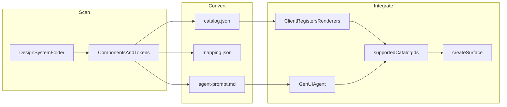

# Use cases

This repo converts an **existing design system** into an [A2UI v0.9](https://a2ui.org/catalogs/) catalog — the JSON Schema contract a GenUI agent uses to emit UI your client already renders.

Every use case below follows the same pipeline:



Try the sample end-to-end:

```bash
npm install
npx tsx src/cli.ts convert examples/acme-ds --out examples/acme-ds/a2ui
```

---

## 1. Mature React or Vue design system → agent-safe catalog

**Who benefits:** Design-system and frontend-platform teams shipping `Button`, `Card`, `TextField`, and layout primitives in React/Vue.

**Problem:** A2UI’s Basic Catalog uses generic names (`Text`, `Button`, `Row`). Your product already has branded components with different props (`variant`, `tone`, `onPress`). Adapting Basic Catalog in the client is brittle.

**What you run:**

```bash
npx tsx src/cli.ts convert ./packages/ui --catalogId https://yourco.com/a2ui/v0.9/catalog.json
```

**What you get:** A catalog whose component names match your library. Props are mapped to A2UI types — e.g. `onPress` → `action`, `children` → `ChildList`, string unions → `enum`.

**Next steps:** Wire [`react-registry.stub.ts`](../examples/acme-ds/a2ui/react-registry.stub.ts) to your real components. Register the catalog in your A2UI client.

**Not covered:** Production renderers, Storybook, or visual regression tests.

---

## 2. Constrain a GenUI agent to your allowlist

**Who benefits:** Agent / ML engineers building A2A or MCP agents that emit UI.

**Problem:** Without a catalog, models invent components, props, and nesting that your client cannot render.

**What you run:** Convert once (or in CI on every design-system release). Check in `catalog.json` and `agent-prompt.md`.

**What you use:**

| Output | Role |
| --- | --- |
| `catalog.json` | Schema the model must conform to |
| `agent-prompt.md` | System instructions: allowed names, `catalogId`, child-by-id rules |
| `client-capabilities.json` | Payload for `a2uiClientCapabilities.supportedCatalogIds` |

**Next steps:** Load the catalog into your agent toolchain (e.g. A2UI SDK `SendA2uiToClientToolset` or equivalent). On `createSurface`, set `catalogId` to the same URI as in the catalog file.

**Not covered:** LLM hosting, tool routing, or runtime validation beyond basic catalog checks in this CLI.

---

## 3. Brownfield product — keep your visual language

**Who benefits:** Product teams adding an AI assistant to an app that already uses a company design system.

**Problem:** You want agent-generated UI to look like the rest of the product, not like a generic chat widget.

**What you run:** Point the converter at the same package your app imports for UI.

**Why this approach:** [A2UI recommends](https://a2ui.org/guides/defining-your-own-catalog/) catalogs that **mirror** your design system instead of mapping Basic Catalog through adapters.

**Next steps:**

1. Convert → `catalog.json`
2. Client advertises your `catalogId` in `supportedCatalogIds`
3. Agent selects that catalog when creating a surface
4. Map catalog names to existing React/Vue/Flutter widgets

**Not covered:** Migrating legacy screens or replacing human-built UI.

---

## 4. Tokens and theme without a full typed component library

**Who benefits:** Design ops teams with CSS variables, Style Dictionary, or DTCG token JSON but incomplete component typings.

**Problem:** You need theme properties (`primaryColor`, spacing, radius) in A2UI `createSurface.theme` even before every widget is cataloged.

**What you run:** Convert a folder that contains `tokens.css`, `tokens.json`, or similar. Optionally add components later.

**What you get:** Theme section in `catalog.json` populated from `--color-primary` and `{ "value": "#..." }` token trees.

**Next steps:** Use theme keys in agent prompts. Add components via source scan or `a2ui.manifest.json` as the library matures.

**Not covered:** Figma → code or automatic component discovery from design files.

---

## 5. Explicit inventory with a manifest (security allowlist)

**Who benefits:** Teams with messy monorepos, generated code, or strict security requirements.

**Problem:** Auto-scan picks up too many files, or you must **only** expose a curated subset of components to agents.

**What you run:** Add [`a2ui.manifest.json`](../examples/acme-ds/a2ui.manifest.json) listing allowed components and props. Manifest entries take precedence over duplicate names from scan.

**Example:**

```json
{
  "name": "acme-ds",
  "catalogId": "https://acme.example/a2ui/v0.9/catalog.json",
  "components": [
    {
      "name": "Button",
      "source": "components/Button.tsx",
      "props": [
        { "name": "label", "kind": "string", "required": true },
        { "name": "variant", "kind": "enum", "enumValues": ["primary", "ghost"] }
      ]
    }
  ]
}
```

**Next steps:** Treat the manifest as your security boundary — only registered names appear in `catalog.json`.

**Not covered:** Runtime sandboxing of agent actions; you still validate `action` payloads in the client.

---

## 6. Multi-brand and white-label

**Who benefits:** Organizations with multiple brands sharing one codebase (different tokens, same component APIs).

**Problem:** Each brand needs its own `catalogId`, theme, and possibly a different component subset — but the same conversion pipeline.

**What you run:** One conversion per brand, with distinct output folders and catalog IDs:

```bash
npx tsx src/cli.ts convert ./brands/acme   --catalogId https://acme.example/a2ui/v0.9/catalog.json   --out ./brands/acme/a2ui

npx tsx src/cli.ts convert ./brands/contoso --catalogId https://contoso.example/a2ui/v0.9/catalog.json --out ./brands/contoso/a2ui
```

**Next steps:** Client sends ordered `supportedCatalogIds`; agent locks each surface to one catalog for its lifetime.

**Not covered:** Dynamic per-user theming at runtime (you pass theme in `createSurface`, not re-convert on every request).

---

## What this tool is not for

| Expectation | Reality |
| --- | --- |
| Generates React/Vue renderers | Only a stub registry and JSON Schema |
| Replaces Figma or design tools | Reads code and token files only |
| Calls Google A2UI SDK or Gemini | Offline CLI; no cloud APIs |
| Ships a live A2UI client | You integrate outputs into your app |

For open-source collaboration and publishing, see [Publishing on GitHub](./github-publish.md).
